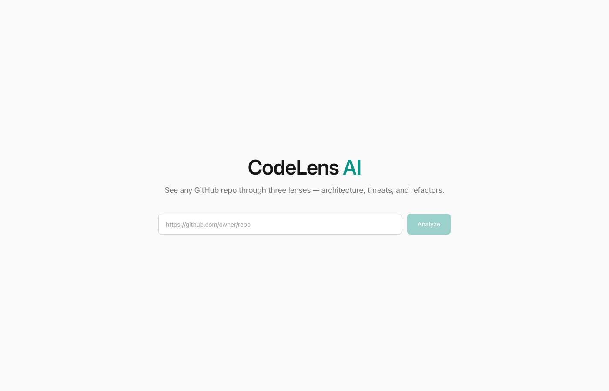
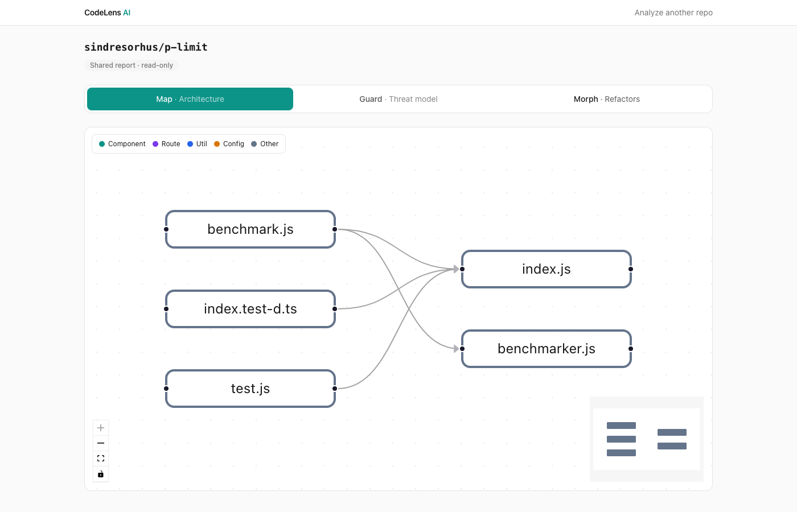
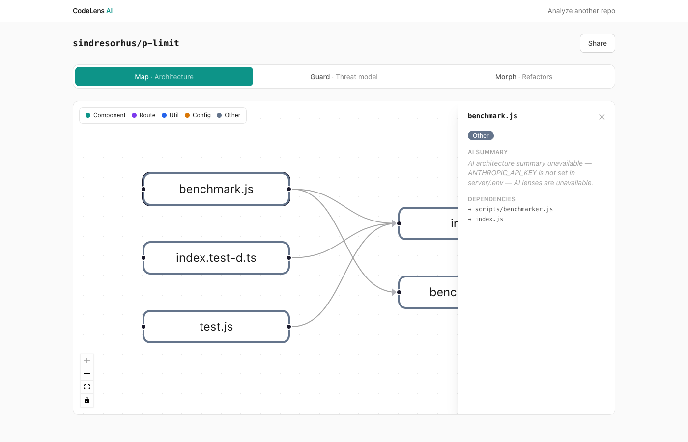

<div align="center">


# CodeLens AI

**X-ray vision for any public GitHub repository.**

[](https://www.typescriptlang.org/)
[](https://react.dev/)
[](https://console.groq.com/)
[](LICENSE)

Paste a GitHub URL. Get a full architecture map, an AI-powered STRIDE threat model, and actionable refactor suggestions — in seconds.

</div>

---

## ✨ Three Lenses

| 🗺️ **Map** | 🛡️ **Guard** | 🔬 **Morph** |
|---|---|---|
| Interactive dependency graph of every file and its imports | STRIDE threat model with per-finding severity and mitigations | Code-smell detection with side-by-side before/after diffs |

## Screenshots

| Landing | Map |
|---|---|
|  |  |



> Guard and Morph require a `GROQ_API_KEY`. Without one the graph still works and those tabs show a clear "analysis unavailable" state.

---

## 🏗️ Stack

| Layer | Tech |
|-------|------|
| **Client** | React 19, Vite, TypeScript, Tailwind CSS v4, Framer Motion, React Flow |
| **Server** | Node.js, Express 5, TypeScript, Groq SDK (`llama-3.3-70b-versatile`), Octokit |

---

## 🚀 Quick Start

### 1 — Install

```sh
npm install
npm install --prefix client
npm install --prefix server
```

### 2 — Configure

```sh
cp server/.env.example server/.env
```

| Variable | Required | Description |
|----------|----------|-------------|
| `GROQ_API_KEY` | ✅ | Get one free at [console.groq.com](https://console.groq.com/) |
| `GITHUB_TOKEN` | Recommended | Read-only PAT — avoids GitHub's 60 req/hr anonymous limit |
| `GROQ_MODEL` | Optional | Override the default model (`llama-3.3-70b-versatile`) |

### 3 — Run

```sh
npm run dev
```

| Service | URL |
|---------|-----|
| Client | http://localhost:5173 |
| Server | http://localhost:3001 |
| Health | `GET /api/health` → `{ "ok": true }` |

---

## 🛠️ Scripts

```sh
npm run dev          # client + server together
npm run dev:client   # Vite only on :5173
npm run dev:server   # Express (tsx watch) on :3001
npm run typecheck    # tsc on both packages
```

---

## 🧠 How It Works

```
client (React/Vite :5173)                server (Express :3001)
┌────────────────────────┐  POST /api/analyze  ┌──────────────────────────────┐
│  App — state machine   │ ──────────────────▶ │ github.ts   fetch git tree   │
│  idle/loading/done/err │                     │             + blobs (≤50)    │
│                        │                     │ graph.ts    import parsing → │
│  Results — 3 tabs      │                     │             { nodes, edges } │
│  ├─ MapView            │                     │ analysis.ts 3 Groq calls     │
│  ├─ GuardView          │ ◀────────────────── │             (allSettled)     │
│  └─ MorphView          │  AnalysisResult     │ llm.ts      single provider  │
│                        │                     │             seam             │
│  /r/:id  read-only     │  GET /api/report/id │ cache.ts    10-min TTL       │
└────────────────────────┘                     └──────────────────────────────┘
```

**Repo fetch** — pulls the git tree of the default branch, filters to `.js .jsx .ts .tsx .py` (max 50 files, skipping `node_modules`, `dist`, `.d.ts`, minified and >200 KB files, preferring shallow paths).

**Dependency graph** — regex-extracts `import` / `require` / `from` specifiers and resolves local imports, inferring a node type (`component | route | util | config | other`) from the path.

**AI lenses** — three independent structured Groq calls sharing one truncated code context (≤800 chars/file, ≤8 KB total). Strict JSON output with a parse-and-retry guard. `Promise.allSettled` means a failed lens never blocks the others.

**Caching & sharing** — results cached 10 minutes in-memory, keyed by repo URL and a short hex report ID. The Share button copies `/r/:id` as a read-only link.

---

## ⚠️ Limitations

- Max **50 source files** per repo (shallowest paths first)
- Share links expire after **10 minutes** (in-memory; restart clears all reports)
- **Public repos only**
